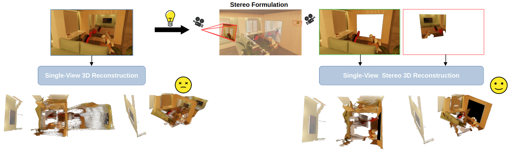
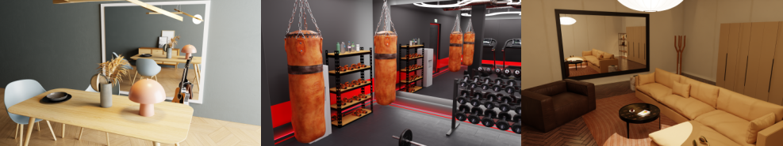

<p align="center">
  
  <h1 align="center"><strong>[3DV 2026] Reflect3r: Single-View 3D Stereo Reconstruction Aided by Mirror Reflections</strong></h3>

  <p align="center">
    <a href="https://jingwu2121.github.io/" class="name-link" target="_blank">Jing Wu</a>,
    <a href="https://scholar.google.com/citations?user=zCBKqa8AAAAJ&hl=en" class="name-link" target="_blank">Zirui Wang</a>,
    <a href="https://scholar.google.com/citations?user=n9nXAPcAAAAJ&hl=en" class="name-link" target="_blank">Iro Laina</a>,
    <a href="https://www.robots.ox.ac.uk/~victor/" class="name-link" target="_blank">Victor Adrian Prisacariu</a>
    <br>
    University of Oxford
</p>

<div align="center">

[](https://arxiv.org/abs/2509.20607)
[](https://jingwu2121.github.io/reflect3r/)
[](https://huggingface.co/datasets/jinggogogo/reflect3r_synthetic_data)
[](LICENSE)
</div>

<div style="background-color: white; display: inline-block; padding: 10px;">
  
</div>

## Abstract
Mirror reflections are common in everyday environments and can provide stereo information within a single capture, as the real and reflected virtual views are visible simultaneously.
We exploit this property by treating the reflection as an auxiliary view and designing a transformation that constructs a physically valid virtual camera, allowing direct pixel-domain generation of the virtual view while adhering to the real-world imaging process.
This enables a multi-view stereo setup from a single image, simplifying the imaging process, making it compatible with powerful feed-forward reconstruction models for generalizable and robust 3D reconstruction.
To further exploit the geometric symmetry introduced by mirrors, we propose a symmetric-aware loss to refine pose estimation.
Our framework also naturally extends to dynamic scenes, where each frame contains a mirror reflection, enabling efficient per-frame geometry recovery.
For quantitative evaluation, we provide a fully customizable synthetic dataset of 16 Blender scenes, each with ground-truth point clouds and camera poses.
Extensive experiments on real-world data and synthetic data are conducted to illustrate the effectiveness of our method. 

## ✨ News
- [18.03.2026] Our synthetic evaluation dataset can now be downloaded in [Voxel51](https://huggingface.co/datasets/Voxel51/reflect3er) 

##  Citation
If you find this code or find the paper useful for your research, please consider citing:
```
@article{wu2026reflect3r,
author = {Wu, Jing and Wang, Zirui and Laina, Iro and Prisacariu, Victor},
title = {{Reflect3r: Single-View 3D Stereo Reconstruction Aided by Mirror Reflections}},
journal = {3DV},
year = {2026},
}
```

##  Installation

1. Clone the repo

```bash
git clone --recursive https://github.com/jingwu2121/reflect3r
cd reflect3r
```

2. Install the environment, we follow the [DUSt3R](https://github.com/naver/dust3r) environment, please also refer to DUSt3R's issue page if there is any environment issue. 
```bash
conda create -n reflect3r python=3.11 
conda activate reflect3r 
conda install pytorch torchvision pytorch-cuda=12.1 -c pytorch -c nvidia  # use the correct version of cuda for your system
pip install -r requirements.txt
```

3. Download the model weights for the mirror detection from [here](https://hkustgz-my.sharepoint.com/personal/zxing565_connect_hkust-gz_edu_cn/_layouts/15/onedrive.aspx?viewid=712c90f5%2D05a1%2D4087%2Db912%2D7c8b36f62dbe&ga=1&id=%2Fpersonal%2Fzxing565%5Fconnect%5Fhkust%2Dgz%5Fedu%5Fcn%2FDocuments%2FCVPR25%5FDAM%2Flatest%2Epth&parent=%2Fpersonal%2Fzxing565%5Fconnect%5Fhkust%2Dgz%5Fedu%5Fcn%2FDocuments%2FCVPR25%5FDAM) and put it under the `weight` folder. This is the guide of the mirror detection's original repo: [here](https://github.com/ge-xing/DAM?tab=readme-ov-file#model). 

##  Synthetic Evaluation Data


We built a collection of synthetic Blender scenes containing mirror reflections to evaluate single-view stereo reconstruction in the context of mirror. 

###  Download from Voxel51 Group Dataset

Please check the instruction [here](https://huggingface.co/datasets/Voxel51/reflect3er)!

#### Installation

```bash
pip install -U fiftyone openexr
```

#### Usage

```python

import fiftyone as fo
from huggingface_hub import snapshot_download


# Download the dataset snapshot to the current working directory

snapshot_download(
    repo_id="Voxel51/reflect3er", 
    local_dir=".", 
    repo_type="dataset"
    )


# Load dataset from current directory using FiftyOne's native format
dataset = fo.Dataset.from_dir(
    dataset_dir=".",  # Current directory contains the dataset files
    dataset_type=fo.types.FiftyOneDataset,  # Specify FiftyOne dataset format
    name="reflect3er"  # Assign a name to the dataset for identification
)

```

### 🤗 Download from HF


Download our synthetic evaluation data [here](https://huggingface.co/datasets/jinggogogo/reflect3r_synthetic_data). 
- Download the [original blender scenes](https://huggingface.co/datasets/jinggogogo/reflect3r_synthetic_data/tree/main/blender_source_files)
- Download the [processed data](https://huggingface.co/datasets/jinggogogo/reflect3r_synthetic_data/tree/main/rendered_data)

Scripts for Modelling in Blender
- Use `data_toolkit/add_mirrored_cam.py` to model a mirrored camera against the mirror plane in Blender's scripting tab. 
- Use `data_toolkit/render_depth.py` to render the depth, rgb images and camera information from Blender scripting. 

Generate the ground-truth point cloud for evaluation:
```bash
python data_toolkit/syn_gt_point_cloud_gen.py --scene_name '<SCENE TO PROCESS>' --save_root '/path/to/save'
```

## Demo Example
We include 3 example images in the `examples` folder. 
Run this code for the reflect3r demo. 

```bash
python reflect3r_pipeline.py --input_image_path examples/example1.png
```

The result will be saved to `results/reconstructed_point_cloud.ply`. 

## Acknowledgement
Zirui Wang is supported by an ARIA research gift grant from Meta Reality Lab.

Our Code is built upon: 
- DUSt3R: https://github.com/naver/dust3r

The 16 Blender scenes are collected from online websites, we rearranged and cleaned the scenes and modelled a mirror on top of them for research purpose. Here we listed all the original download links for these scenes, we thank these designers for their great work.
- Archiviz: https://download.blender.org/demo/cycles/flat-archiviz.blend
- Bedroom: https://www.cgtrader.com/free-3d-models/interior/bedroom/the-bed-room
- Blue bathroom: https://www.blenderkit.com/asset-gallery-detail/b6876684-5516-4973-b4a4-e500c49899b6/
- Computer room: https://www.cgtrader.com/free-3d-models/interior/interior-office/a-room-9e4a1359-ef9d-460e-9091-b78c36961e09
- Cozy living room: https://www.blenderkit.com/asset-gallery-detail/a9267e7e-7cd7-4d5d-b479-8bf8fff2eddf/
- Greenhouse: https://www.blenderkit.com/asset-gallery-detail/751fbc52-ab6e-475a-b9e0-6ee99a8f45bb/
- Gym: https://www.cgtrader.com/free-3d-models/architectural/other/high-quality-modern-indoor-gym
- Livingroom contemporary: https://www.cgtrader.com/free-3d-models/interior/living-room/living-room-contemporary-57e8df25-0df2-4080-99ea-e2e7f0a7bb7a
- Loft: https://www.cgtrader.com/free-3d-models/interior/living-room/project-b-54e79cb8-6763-471e-9d42-1e7e6cf01e14
- MiniGym: https://www.cgtrader.com/free-3d-models/interior/other/mini-gym-blender-scene
- Minimal interior: https://www.blenderkit.com/asset-gallery-detail/c675b544-6e32-42fd-b840-f2fdd964f610/
- Modern living room: https://www.cgtrader.com/free-3d-models/interior/living-room/modern-living-room-1179d95e-c242-4ff2-b1b9-85f7373c139e
- Livingroom: https://www.cgtrader.com/free-3d-models/interior/living-room/living-room-interior-for-blender-cycles-ready
- Scandinavian: https://www.cgtrader.com/free-3d-models/interior/other/free-dining-set-scandinavian-style
- Sunlight: https://www.cgtrader.com/free-3d-models/interior/living-room/sunlight-and-concrete-blender-interior
- Terrazzo: https://www.blenderkit.com/asset-gallery-detail/893df9db-a9e4-46da-9d4a-06be1045d73b/

